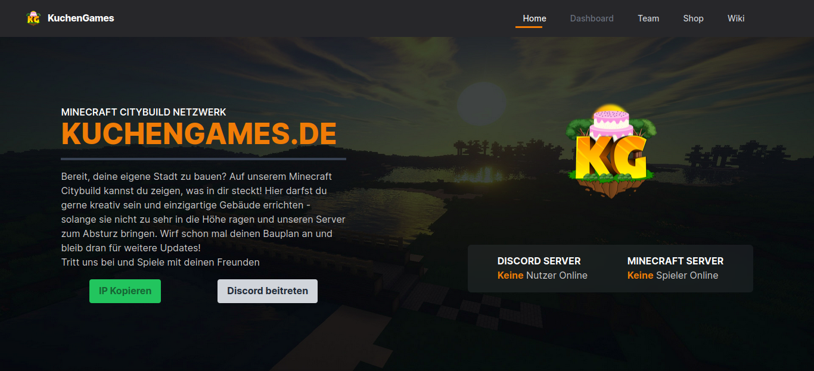

# KuchenGames WIKI ( PWA )

## The [wiki.kuchengames.de](https://wiki.kuchengames.de) homepage

---

  

---

### Run the development server

> npm run dev

To run it in a public network mode

> npm run pubdev

---

#### Build the website to a static serve-able folder

> npm run build

A folder named dist will be created with all sources and assets inside it which can be served

---

#### Format code with prettier

> npm run format

Prettier Formats the source code in the src/ directory

---

Copyright © 2023 » [wiki.kuchengames.de](https://wiki.kuchengames.de)
